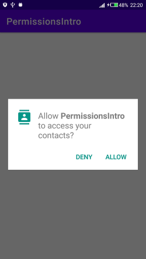
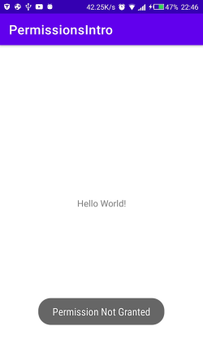
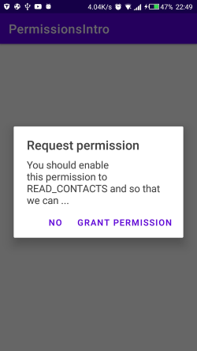

# Demonstration of Requesting Run-Time Permissions

1. Upon first time launch

2. On pressing deny

3. On pressing allow

4. On relaunching the app after pressing deny

5. On relaunching the app after pressing deny

6. On relaunching the app after pressing deny then no

7. On relaunching the app after pressing deny then yes







## MainActivity.kt

```Kotlin
class MainActivity : AppCompatActivity() {

    private val MY_PERMISSION_REQUEST_READ_CONTACTS = 1

    override fun onCreate(savedInstanceState: Bundle?) {
        super.onCreate(savedInstanceState)
        setContentView(R.layout.activity_main)

        //CHECK IF PERMISSION IS GRANTED OR NOT
        when {
            ContextCompat.checkSelfPermission(this, Manifest.permission.READ_CONTACTS) == PackageManager.PERMISSION_GRANTED -> {
                Toast.makeText(this, "Permission already Granted", Toast.LENGTH_LONG).show()
                // permission has already been granted
                //performAction(...)
            }
            shouldShowRequestPermissionRationale(Manifest.permission.READ_CONTACTS) -> {
                val builder = AlertDialog.Builder(this)
                builder.setTitle("Request permission")
                builder.setMessage("You should enable this permission to READ_CONTACTS and so that we can ...")
                builder.setNegativeButton("No") { dialogInteface, which ->
                    ActivityCompat.requestPermissions(this, arrayOf(Manifest.permission.READ_CONTACTS), MY_PERMISSION_REQUEST_READ_CONTACTS)
                }
                builder.setPositiveButton("Grant Permission") { dialogInteface, which ->
                    ActivityCompat.requestPermissions(this, arrayOf(Manifest.permission.READ_CONTACTS), MY_PERMISSION_REQUEST_READ_CONTACTS)
                }
                builder.show()
            }
            else -> {
                // You can directly ask for the permission.
                ActivityCompat.requestPermissions(this, arrayOf(Manifest.permission.READ_CONTACTS), MY_PERMISSION_REQUEST_READ_CONTACTS)
            }
        }
    }

    override fun onRequestPermissionsResult(requestCode: Int, permissions: Array<out String>, grantResults: IntArray) {
        when (requestCode) {
            MY_PERMISSION_REQUEST_READ_CONTACTS -> {
                // If request is cancelled, the result arrays are empty.
                if ((grantResults.isNotEmpty() && grantResults[0] == PackageManager.PERMISSION_GRANTED)) {
                    // Permission is granted. Continue the action or workflow in your app.
                    Toast.makeText(this, "Permission Granted", Toast.LENGTH_LONG).show()
                } else {
                    // Explain to the user that the feature is unavailable because
                    // the features requires a permission that the user has denied.
                    // At the same time, respect the user's decision. Don't link to
                    // system settings in an effort to convince the user to change
                    // their decision.
                    Toast.makeText(this, "Permission Not Granted", Toast.LENGTH_LONG).show()
                }
                return
            }
            // Add other 'when' lines to check for other
            // permissions this app might request.
            else -> {
                // Ignore all other requests.
            }
        }
    }
}
```

## **Android permissions with Protection level: dangerous**

| Permission                 | Description                                                                                                                                                                                                                                   |
| -------------------------- | --------------------------------------------------------------------------------------------------------------------------------------------------------------------------------------------------------------------------------------------- | --- |
| ACCEPT_HANDOVER            | Allows a calling app to continue a call which was started in another app. An example is a video calling app that wants to continue a voice call on the user's mobile network.                                                                 |     |
| ACCESS_BACKGROUND_LOCATION | Allows an app to access location in the background. If you're requesting this permission, you must also request either ACCESS_COARSE_LOCATION or ACCESS_FINE_LOCATION. Requesting this permission by itself doesn't give you location access. |
| ACCESS_COARSE_LOCATION     | Allows an app to access approximate location                                                                                                                                                                                                  |
| ACCESS_FINE_LOCATION       | Allows an app to access precise location                                                                                                                                                                                                      |
| ACCESS_MEDIA_LOCATION      | Allows an application to access any geographic locations persisted in the user's shared collection.                                                                                                                                           |
| ACTIVITY_RECOGNITION       | Allows an application to recognize physical activity.                                                                                                                                                                                         |
| ADD_VOICEMAIL              | Allows an application to add voicemails into the system.                                                                                                                                                                                      |
| ANSWER_PHONE_CALLS         | Allows the app to answer an incoming phone call.                                                                                                                                                                                              |
| BODY_SENSORS               | Allows an application to access data from sensors that the user uses to measure what is happening inside their body, such as heart rate                                                                                                       |
| CALL_PHONE                 | Allows an application to initiate a phone call without going through the Dialer user interface for the user to confirm the call.                                                                                                              |
| CAMERA                     | Required to be able to access the camera device.                                                                                                                                                                                              |
| READ_CALENDAR              | Allows an application to read the user's calendar data.                                                                                                                                                                                       |
| READ_CALL_LOG              | Allows an application to read the user's call log.                                                                                                                                                                                            |
| READ_CONTACTS              | Allows an application to read the user's contacts data.                                                                                                                                                                                       |
| READ_EXTERNAL_STORAGE      | Allows an application to read from external storage.                                                                                                                                                                                          |
| READ_PHONE_NUMBERS         | Allows read access to the device's phone number(s). This is a subset of the capabilities granted by READ_PHONE_STATE but is exposed to instant applications.                                                                                  |
| READ_SMS                   | Allows an application to read SMS messages.                                                                                                                                                                                                   |
| RECEIVE_MMS                |                                                                                                                                                                                                                                               |
| RECEIVE_SMS                |                                                                                                                                                                                                                                               |
| RECEIVE_WAP_PUSH           |                                                                                                                                                                                                                                               |
| RECORD_AUDIO               |                                                                                                                                                                                                                                               |
| SEND_SMS                   |                                                                                                                                                                                                                                               |
| USE_SIP                    | Allows an application to use SIP service.                                                                                                                                                                                                     |
| WRITE_CALENDAR             |                                                                                                                                                                                                                                               |
| WRITE_CALL_LOG             |                                                                                                                                                                                                                                               |
| WRITE_CONTACTS             |                                                                                                                                                                                                                                               |
| WRITE_EXTERNAL_STORAGE     |                                                                                                                                                                                                                                               |
